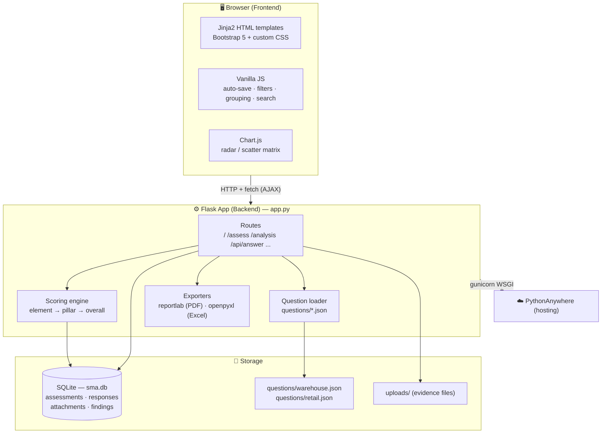

# SMA System — Safety Maturity Assessment

A web application for conducting **Safety Maturity Assessments (SMA)** across Warehouse
and Retail business units. Assessors answer level-based questions per site, the system
scores them automatically (element → pillar → overall), and presents results through a
dashboard, an analysis matrix, and PDF/Excel exports.

🌐 **Live app:** https://kantapon.pythonanywhere.com
📚 **Checklists:** Warehouse (159 questions) · Retail Store (62) · Retail Local Company (57)

---

## 1. What it does

- **Run assessments** — answer Yes / No / N/A / Not-rolled-out for each question, with comments and file attachments. Auto-saves on every click.
- **Score automatically** — a maturity engine converts answers into a 1–5 score per element, pillar, and overall, split into *Safety Awareness* and *System Implementation* axes.
- **Two checklist types** — Warehouse and Retail (Store + Local Company scopes), each with its own question set and judgement criteria.
- **Dashboard** — assessments grouped by business unit (🚛 Warehouse / 🛞 Retail) with a BU summary table (counts + pillar averages).
- **Analysis** — SMA scatter matrix, pillar radar charts, and standard-by-standard comparison.
- **Interview mode** — re-group questions into the order they are asked in the field (Manager → Supervisor → Teammate → Genba → Documents).
- **Exports** — PDF and Excel reports per assessment.

---

## 2. Full-stack architecture



### Layers

| Layer | Technology | Responsibility |
|-------|-----------|----------------|
| **Frontend** | Jinja2 templates, Bootstrap 5, vanilla JS, Chart.js | Renders pages; client-side filtering, interview-grouping, search, live score updates |
| **Backend** | Python + Flask (`app.py`) | Routing, scoring engine, question loading, exports |
| **Data** | SQLite (`sma.db`) + JSON question banks | Persists assessments/answers; questions defined in version-controlled JSON |
| **Hosting** | gunicorn on PythonAnywhere | Always-on WSGI server |

---

## 3. Data model (SQLite)

| Table | Purpose |
|-------|---------|
| `assessments` | One row per assessment (site, type, scope, assessors, status, date) |
| `responses` | One row per answered question (assessment_id, question_id, answer, comment) |
| `attachments` | Evidence files linked to a question |
| `findings` | Improvement actions generated from "No" answers |
| `users`, `gcs` | Users and group-company reference data |

Questions themselves are **not** in the database — they live in `questions/warehouse.json`
and `questions/retail.json` (pillars → elements → questions, each with `level`,
`answered_by`, `audit_methods`, `standard`, and `judgement_criteria`).

---

## 4. How scoring works

Bottom-up, per assessment:

1. **Element score** — questions are grouped by maturity level 1–5. Walking up the levels, the **first level containing a "No"** sets the score: `score = level − 1` (minimum 1). All "Yes" → 5. (N/A and Not-rolled-out are skipped.)
2. **Pillar score** = the **lowest** element score in that pillar.
3. **Overall (SMA)** = the average of the four pillars (Leadership, Teammate Engagement, Organization, System).
4. **Axes** — *Safety Awareness* = Leadership + Teammate + Organization; *System Implementation* = System.

Maturity levels: `1 Ad-hoc · 2 Reactive · 3 Standardized · 4 Proactive · 5 Excellence`.

---

## 5. Request flow (answering a question)

```
User clicks an answer
   → JS sends fetch POST /api/answer  {assessment_id, question_id, answer, comment}
      → Flask upserts the response row in sma.db
      → recalculates scores from all answers + the question JSON
      → returns updated scores as JSON
   → JS updates the score panel live (no page reload)
```

---

## 6. Project structure

```
sma_simple/
├── app.py                 # Flask app: routes, scoring engine, exports
├── questions/
│   ├── warehouse.json     # Warehouse question bank (159)
│   └── retail.json        # Retail question bank (Store 62 + Local Company 57)
├── templates/             # Jinja2 HTML (dashboard, assess, analysis, result, ...)
├── static/                # Bootstrap, Chart.js, custom style.css
├── requirements.txt       # flask, openpyxl, reportlab, gunicorn
├── Procfile / railway.json# Deployment config
└── sma.db                 # SQLite database (NOT committed — gitignored)
```

> **Note:** the database (`sma.db`), uploaded evidence (`uploads/`), and any secrets
> (`.env`) are git-ignored — the repository contains the **application and question
> content only**, never assessment results.

---

## 7. Running locally

```bash
pip install -r requirements.txt
python app.py            # serves on http://localhost:5001
```

For production it runs under gunicorn (see `Procfile`):

```bash
gunicorn app:app --bind 0.0.0.0:$PORT --workers 2 --timeout 120
```

---

## 8. Tech summary

`Python` · `Flask` · `Jinja2` · `SQLite` · `Bootstrap 5` · `Chart.js` ·
`reportlab` (PDF) · `openpyxl` (Excel) · `gunicorn` · hosted on **PythonAnywhere**.
